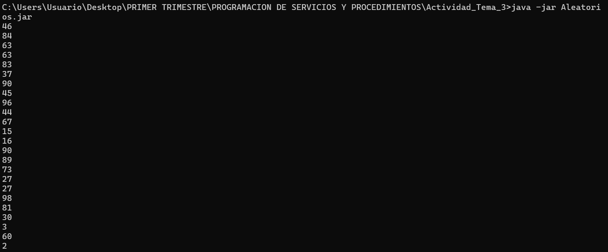
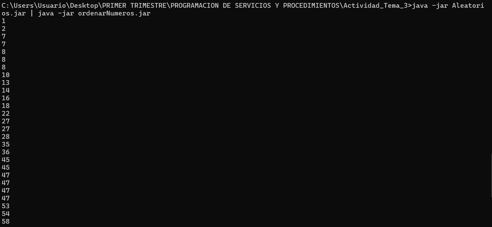

# 🎲🔀 Generador y Ordenador de Números Aleatorios en Java

Este proyecto contiene **dos programas en Java** que trabajan juntos utilizando **tuberías (pipes)** en la terminal:

1. **`Aleatorios`** ➡️ Genera números aleatorios.
2. **`ordenarNuemeros`** ➡️ Toma esos números por la entrada estándar, los procesa y los ordena.

---

## 📌 Funcionamiento

### 🧩 1. Aleatorios
- Genera **40 números aleatorios** entre `0` y `100`.
- Imprime cada número en la consola (uno por línea).

---

### 🧩 2. ordenarNuemeros
- Recibe los números por **entrada estándar (STDIN)**.
- Convierte cada línea en un número entero.
- Ordena los números y los muestra en consola.

---

## ⚙️ Compilación

📌 Paso a paso
Abre CMD desde la carpeta donde están los .jar.

Ejecuta el siguiente comando:

cmd
java -jar Aleatorios.jar | java -jar ordenarNuemeros.jar
🔹 Qué sucede
java -jar Aleatorios.jar genera los números aleatorios y los envía a su salida estándar.

El pipe | toma esa salida y la envía como entrada estándar al programa ordenarNuemeros.

ordenarNuemeros lee los números, los ordena y los imprime en consola ya ordenados.

🔹 Ejemplo de salida
Si Aleatorios.jar genera:

El comando completo con pipe mostrará:

✨ Autor: Miguel Ángel Pérez

👨‍💻 Proyecto creado como práctica de manejo de tuberías y entrada/salida en Java.
